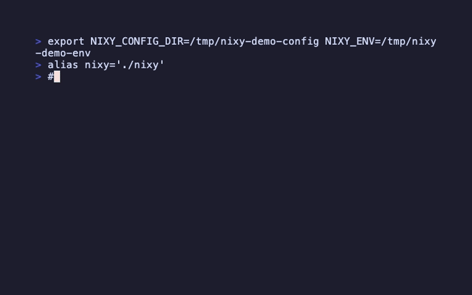

# nixy - Simple Declarative Nix Package Management

[日本語版はこちら](README_ja.md)



**Reproducible Nix packages, simple commands.** Install packages with a single command, sync them across all your machines.

```bash
nixy install ripgrep    # That's it. Nix made simple.
```

nixy manages your Nix packages through a declarative `flake.nix`. Unlike `nix profile` which lacks built-in reproducibility, nixy ensures the same packages and versions on every machine. Written in Rust for reliability and performance.

## Motivation

**For users frustrated with Homebrew, asdf, or similar tools** who want:
- Reproducible environments across machines (not just "it works on my machine")
- Atomic upgrades that never leave your system in a broken state
- A single lockfile for all packages (no more version drift)

**nixy is a package management layer on top of Nix.** It doesn't replace Nix's full capabilities (dev shells, builds, NixOS) - it focuses solely on managing globally installed packages, like Homebrew does.

### What nixy gives you:
- **Simple commands**: `nixy install`, `nixy uninstall`, `nixy upgrade`
- **True reproducibility**: `flake.nix` + `flake.lock` = identical environments everywhere
- **Multiple profiles**: Separate package sets for work, personal, projects
- **No lock-in**: Plain Nix underneath - eject anytime
- **Cross-platform**: Same workflow on macOS and Linux

### What nixy is NOT:
- A replacement for Home Manager or NixOS
- A development environment tool (use `nix develop` for that)
- A build system

If you want Homebrew's simplicity with Nix's reproducibility for your CLI tools, nixy is for you.

## How it works

nixy uses plain Nix features - no Home Manager, no NixOS, no complex setup. Your packages are defined in `flake.nix` at `~/.config/nixy/profiles/<name>/`, built with `nix build`.

nixy is **purely declarative** - your `flake.nix` is the single source of truth. Unlike `nix profile` which maintains mutable state, nixy uses `nix build --out-link` to create a symlink (`~/.local/state/nixy/env`) pointing to your built environment. This means:
- No hidden profile state to get out of sync
- What's in `flake.nix` is exactly what's installed
- Easy to understand, debug, and version control

nixy edits the flake.nix and runs standard `nix` commands. The flake.nix it generates is plain Nix - you can read it, edit it manually, or use `nix` commands directly anytime.

## nixy and nix profile

nixy is not a replacement for `nix profile` - it's a complement that adds reproducibility.

`nix profile` is great for quick, single-machine package management. nixy adds a declarative layer on top of Nix for when you need:

- **A unified lockfile**: All packages pinned to the same nixpkgs version
- **Easy sync**: Copy `flake.nix` to a new machine, run `nixy sync`, done
- **Version-controlled config**: `flake.nix` is designed for git

nixy and `nix profile` use separate paths (`~/.local/state/nixy/env` vs `~/.nix-profile`) and don't interfere with each other. Use `nix profile` for quick experiments, nixy for your reproducible base environment - or use both together.

## Quick Start

nixy uses **profiles** to organize packages. A "default" profile is created automatically on first use. You can create additional profiles later for different contexts (work, personal, projects).

### 1. Install Nix (if you haven't)

```bash
curl --proto '=https' --tlsv1.2 -sSf -L https://install.determinate.systems/nix | sh -s -- install
```

### 2. Install nixy

**Quick install (recommended):**

```bash
curl -fsSL https://raw.githubusercontent.com/yusukeshib/nixy/main/install.sh | bash
```

This will try (in order): pre-built binary or nix build.

**With cargo (from crates.io):**

```bash
cargo install nixy
```

**With nix:**

```bash
nix profile install github:yusukeshib/nixy
```

**From source:**

```bash
git clone https://github.com/yusukeshib/nixy.git
cd nixy
cargo build --release
cp target/release/nixy ~/.local/bin/
```

### 3. Set up your shell

Add to your shell config (`.bashrc`, `.zshrc`, etc.):

```bash
eval "$(nixy config zsh)"
```

For fish, add to `~/.config/fish/config.fish`:

```fish
nixy config fish | source
```

### 4. Start installing packages

```bash
nixy install ripgrep    # First run auto-creates the default profile
nixy install nodejs
nixy install git

nixy list               # See what's installed
nixy search python      # Find packages
nixy uninstall nodejs   # Remove a package
nixy upgrade            # Upgrade all inputs
nixy upgrade nixpkgs    # Upgrade only nixpkgs
```

Packages are installed globally and available in all terminal sessions.

## Commands

### Package Management

| Command | Alias | Description |
|---------|-------|-------------|
| `nixy install <pkg>` | `add` | Install a package from nixpkgs |
| `nixy install --from <flake> <pkg>` | | Install from a flake (registry name or URL) |
| `nixy install --file <path>` | | Install from a custom nix file |
| `nixy uninstall <pkg>` | `remove` | Uninstall a package |
| `nixy list` | `ls` | List packages in flake.nix |
| `nixy search <query>` | | Search for packages |
| `nixy upgrade [input...]` | | Upgrade all inputs or specific ones |
| `nixy sync` | | Build environment from flake.nix (for new machines) |
| `nixy gc` | | Clean up old package versions |

### Profile Management

| Command | Alias | Description |
|---------|-------|-------------|
| `nixy profile` | | Show current profile |
| `nixy profile switch <name>` | `use` | Switch to a different profile |
| `nixy profile switch -c <name>` | | Create and switch to a new profile |
| `nixy profile list` | `ls` | List all profiles |
| `nixy profile delete <name>` | `rm` | Delete a profile (requires `--force`) |

### Utilities

| Command | Description |
|---------|-------------|
| `nixy config <shell>` | Output shell config (for PATH setup) |
| `nixy version` | Show nixy version |
| `nixy self-upgrade` | Upgrade nixy to the latest version |
| `nixy self-upgrade --force` | Force reinstall even if already at latest |

### Install Options

The `install` command supports several options:

```bash
nixy install ripgrep              # Install from nixpkgs (default)
nixy install --from <flake> <pkg> # Install from external flake
nixy install --file my-pkg.nix    # Install from custom nix file
nixy install --force <pkg>        # Force regeneration of flake.nix
```

Use `--force` when you've made manual edits outside the nixy markers and want to proceed anyway (your custom changes will be lost).

## Multiple Profiles

Maintain separate package sets for different contexts (work, personal, projects):

```bash
nixy profile switch -c work   # Create and switch to a new profile
nixy install slack terraform  # Install work-specific packages

nixy profile switch -c personal  # Create another profile
nixy install spotify games    # Different packages here

nixy profile list             # See all profiles
nixy profile                  # Show current profile
```

Each profile has its own `flake.nix` at `~/.config/nixy/profiles/<name>/`. Switching profiles rebuilds the environment symlink to point to that profile's packages.

**Use cases:**
- **Work vs Personal**: Keep work tools separate from personal apps
- **Client projects**: Different toolchains for different clients
- **Experimentation**: Try new packages without affecting your main setup

**Managing profiles with dotfiles:**

```bash
# Back up all profiles to dotfiles
cp -r ~/.config/nixy/profiles ~/dotfiles/nixy-profiles

# On a new machine, restore and sync
cp -r ~/dotfiles/nixy-profiles ~/.config/nixy/profiles
nixy profile switch work      # Switch to desired profile
nixy sync                     # Build the environment
```

## Sync Across Machines

Your package list is just a text file. Back it up, version control it, or sync it with dotfiles:

```bash
# Back up your package list (default profile)
cp ~/.config/nixy/profiles/default/flake.nix ~/dotfiles/

# On a new machine:
mkdir -p ~/.config/nixy/profiles/default
cp ~/dotfiles/flake.nix ~/.config/nixy/profiles/default/
nixy sync    # Installs everything from flake.nix
```

Same packages, same versions, on every machine.

---

## FAQ

**How do I find the right package name?**
Use `nixy search <keyword>`. Package names sometimes differ from what you expect (e.g., `ripgrep` not `rg`).

**Where are packages actually installed?**
In the Nix store (`/nix/store/`). nixy builds a combined environment and creates a symlink at `~/.local/state/nixy/env` pointing to it. The `nixy config` command sets up your PATH to include this location.

**Can I edit the flake.nix manually?**
Yes! nixy provides custom markers where you can add your own inputs, packages, and paths that will be preserved during regeneration:

```nix
# [nixy:custom-inputs]
my-overlay.url = "github:user/my-overlay";
# [/nixy:custom-inputs]
```

Any content outside these markers will be overwritten when nixy regenerates the flake. For heavy customization, see "Customizing flake.nix" in the Appendix.

**How do I update nixy?**
Run `nixy self-upgrade` to automatically update to the latest version. Alternatively, use `cargo install nixy` or re-run the install script.

**How do I uninstall nixy?**
Delete the `nixy` binary (typically `~/.local/bin/nixy` or `~/.cargo/bin/nixy`). Your flake.nix files remain and work with standard `nix` commands.

**Why not use `nix profile` directly?**
`nix profile` lacks built-in reproducibility - there's no official way to export your packages and recreate the same environment on another machine. nixy uses `flake.nix` as the source of truth, which can be copied, version-controlled, and shared.

**How do I rollback to a previous state?**
Since nixy is declarative, your `flake.nix` and `flake.lock` files *are* the state. If you version control them with git (recommended), rollback is simple:

```bash
git checkout HEAD~1 -- flake.nix flake.lock  # Revert to previous commit
nixy sync                                     # Apply the old state
```

This is more powerful than `nix profile rollback` - you can go back to any point in history, see why changes were made via commit messages, and experiment with branches.

---

## Appendix

### Customizing flake.nix

nixy provides custom markers where you can add your own content that will be preserved when nixy regenerates the flake:

**Custom inputs** - Add your own flake inputs:
```nix
# [nixy:custom-inputs]
my-overlay.url = "github:user/my-overlay";
home-manager.url = "github:nix-community/home-manager";
# [/nixy:custom-inputs]
```

**Custom packages** - Add custom package definitions:
```nix
# [nixy:custom-packages]
my-tool = pkgs.writeShellScriptBin "my-tool" ''echo "Hello"'';
patched-app = pkgs.app.overrideAttrs { ... };
# [/nixy:custom-packages]
```

**Custom paths** - Add extra paths to the buildEnv:
```nix
# [nixy:custom-paths]
my-tool
patched-app
# [/nixy:custom-paths]
```

If you edit content **outside** these markers, nixy will warn you before overwriting:
```
Warning: flake.nix has modifications outside nixy markers.
Use --force to proceed (custom changes will be lost).
```

### For Existing Nix Users

If you already manage your own `flake.nix` and want to use nixy's package list, you can import it:

```nix
{
  inputs.nixy.url = "path:~/.config/nixy";

  outputs = { self, nixpkgs, nixy }: {
    # nixy.packages.<system>.default is a buildEnv with all nixy packages
    # You can use it as a dependency or merge it with your own environment
  };
}
```

This way, nixy manages your package list while you maintain full control of your flake.

### Coexistence with nix profile

nixy and `nix profile` use separate paths and don't conflict:
- nixy: `~/.local/state/nixy/env/bin`
- nix profile: `~/.nix-profile/bin`

If you have both in your PATH, the one listed first takes precedence for packages installed in both. You can use both tools for different purposes.

### Installing from External Flakes

Install packages from any flake using `--from`:

```bash
# Direct flake URL
nixy install --from github:nix-community/neovim-nightly-overlay neovim

# Or use nix registry names
nixy install --from nixpkgs hello
```

The flake is added as a custom input to your `flake.nix`, and the full URL is stored for reproducibility. This works with any flake that exports packages.

### Custom Package Definitions

Install packages from custom nix files:

```bash
nixy install --file my-package.nix
```

Format for `my-package.nix`:
```nix
{
  name = "my-package";
  inputs = { overlay-name.url = "github:user/repo"; };
  overlay = "overlay-name.overlays.default";
  packageExpr = "pkgs.my-package";
}
```

### Config Locations

| Path | Description |
|------|-------------|
| `~/.config/nixy/profiles/<name>/flake.nix` | Profile packages |
| `~/.config/nixy/active` | Current active profile name |
| `~/.config/nixy/profiles/<name>/packages/` | Custom package definitions for profile |
| `~/.local/state/nixy/env` | Symlink to built environment (add `bin/` to PATH) |
| `~/.config/nixy/flake.nix` | Legacy location (auto-migrated to default profile) |

### Environment Variables

| Variable | Default | Description |
|----------|---------|-------------|
| `NIXY_CONFIG_DIR` | `~/.config/nixy` | Location of global flake.nix |
| `NIXY_ENV` | `~/.local/state/nixy/env` | Symlink to built environment |

### Limitations

- Package names use Nix naming (search with `nixy search` to find exact names)
- No GUI app support (like Homebrew Cask) yet
- Requires Nix with flakes enabled (the Determinate installer enables this by default)

## Development

```bash
# Build
cargo build --release

# Run tests
cargo test

# Run with debug output
RUST_LOG=debug cargo run -- install hello
```

## License

MIT
